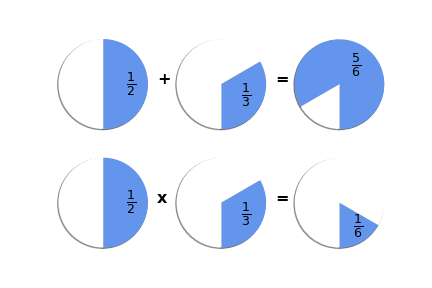

# Fractions

Fractions represent a quantity in terms of a numerator (how much we have) and a denominator (how much in total). In math, we learn how to perform common math functions on fractions.



Let's create a Fraction class in Java and then write methods that can perform math functions on Fraction objects. We'll also create some client code that will create `Fraction`s and add, subtract, multiply, and divide them.



Open Fraction.java to begin. The class we'll define will be called  `Fraction`. 

Next, consider what **attributes** or fields a `Fraction` should have.



In math, we define a fraction is a numerator over a denominator. Once we have those two pieces of information, our fraction is fully defined. So our fields could be:

* numerator
* denominator





Once you have decided on the attribute(s) for the Fraction class, consider how to declare them in the `Fraction.java` file:

* Should the visibility be `public` or `private`?
* What data type should each attribute be?

Then, add the declarations for the attribute(s) to the Fraction class definition.


```
private int numerator;
private int denominator;
```




## Creating Fractions

Now, let's construct a method that allows our client code to pass in a numerator and a denominator as the Fraction object is instantiated (created). 

Add a constructor with parameters for a numerator and a denominator.

In the body of the constructor, add code to set the
value of each attribute (numerator or denominator) to the local variables

<!-- 


`public Fraction(int n, int d)
{
    // Remember, when writing
    // equations in code,
    // the unknown or the
    // variable whose value
    // you want to set goes on
    // the left.
    
    // The right hand side is
    // what you know already,
    // whether a variable with
    // a value assigned, an expression
    // that evaluates to something,
    // or a hard-coded value such as 
    // a number or String literal
    
    // We already know n and d,
    // which are the local variables
    // that get set to the arguments
    // passed in when a Fraction is instantiated.
    
    // On the left side go the variables
    // whose values we want to set, which
    // are the instance variables numerator
    // and denominator.    
}
`

 
-->


Now let's add another constructor that allows us to pass in only a numerator, setting the denominator to 1.


```
public Fraction(int n)
{
    numerator = n;
    denominator = 1;
}
```


Next, let's add a `toString()` method that returns a String
displaying our Fraction as:
`numerator / denominator`


```
public String toString()
{
    return numerator + "/" + denominator;
}
```


Now we're ready to build some client code to try out our Fraction class.



## Client Code
In a new file called `Client.java`, define a `main` method.

Inside the main method, let's declare and instantiate some `Fraction`s. Remember to use the `new` keyword.


```
Fraction quarter = new Fraction(1,4);
Fraction half = new Fraction(1,2);
Fraction whole = new Fraction(1);
```


Let's test our code. To compile, run the following command in the terminal:
```
javac Client.java
```
If there are any compile errors, troubleshoot them before moving on.

Once the program compiles, run it by executing the following command in the terminal:
```
java Client
```


## Math methods


## Copy Constructor


## More Client Code


## Testing

As a reminder, to compile our code we will enter a command at the terminal:

`javac Client.java`

This will compile our Client class and also our Fraction class. Look in the terminal for any compile errors.

Once compiled, the Client code (which contains the main method) can be run by entering at the terminal:

`java Client`

## How to Submit

Execute the below, logging in with your GitHub username and password when prompted. For security, you'll see asterisks (`*`) instead of the actual characters in your password.

```
submit50 mbezaire/checks/main/fractions
```
## Reviewing Feedback


## Challenge

After submitting your fraction work, you may continue with these challenges:
1. Add a method to reduce the fraction. Find the largest common factor of the numerator and denominator and divide them both by that factor.

You can submit your updated code using:

```
submit50 mbezaire/checks/main/fractions-challenge
```

